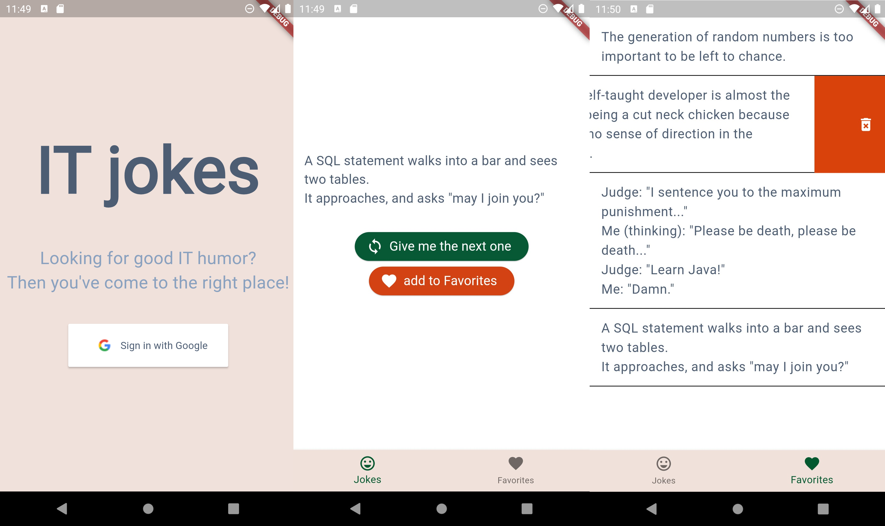

# Flutter Joke App

This simple IT-themed jokes app was created for a student project. The application provides various functionalities using Firebase, including Firebase Authentication for user login, fetching jokes from Firebase Database, and saving favorite jokes to Firebase Database. In addition, the app has a button to enlarge the UI to adjust to users with visual disabilities.

## Tech Stack
- Bloc/Cubit
- Firebase Database
- Firebase Auth
- Freezed
- Dartz
- Equatable
- Clean Architecture

## Features
- **Firebase Authentication:**
  - User authentication using Firebase Auth.

- **Favorite Jokes:**
  - Ability to add a joke to favorites.
  - Displaying favorite jokes in a separate page.

- **Manage Favorites:**
  - Listing favorite jokes in a dedicated section.
  - Option to remove a joke from favorites.

- **Accessibility:**
  - UI adjustment button for improved accessibility.

## App Preview

